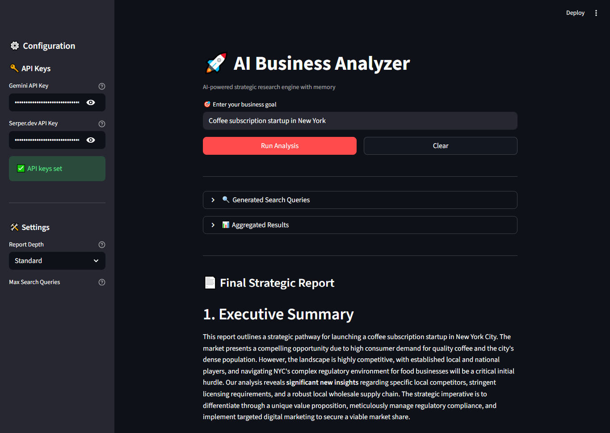

# 🤖 AI Business Analyzer



An autonomous AI-powered business analysis system that researches markets, stores historical insights, and generates structured strategic reports — using persistent memory, live web data, and a clean Streamlit interface.

---

## 🚀 Features

- **Modular agent architecture** for clean separation of concerns
- **Goal-to-task planning** powered by Gemini LLM
- **Live web search** via Serper.dev API
- **Persistent memory** with SQLite for historical insight storage
- **Structured report generation** with actionable business intelligence
- **Streamlit front-end** for an intuitive user experience
- **UV-based** dependency management for fast, reliable installs

---

## 🧠 Architecture Overview

```
User Goal
  → Planner Module
  → Web Search Tool (Serper.dev)
  → Result Aggregator
  → Context Memory
  → Report Generator
  → Memory Storage (SQLite)
  → Streamlit UI Output
```

---

## 🗂 Project Structure


```
├── agent/
│   ├── planner.py          # LLM-based goal-to-task planner
│   ├── researcher.py       # Live web search via Serper.dev API
│   ├── aggregator.py       # Formats & consolidates search results
│   ├── summarizer.py       # Summarizes aggregated research with LLM
│   └── reporter.py         # Generates final structured business report
├── core/
│   └── llm.py              # Gemini API client & LLM configuration
├── config/
│   └── settings.py         # Environment variables & app-wide settings
├── main.py                 # Streamlit app entry point
├── database/               # SQLite persistent memory layer
│   ├── outputs/            # SQLite Database
│   ├── init_db.py          # Schema creation & database initialization
│   ├── read.py             # Query historical insights from DB
│   └── write.py            # Store new analysis results to DB
├── requirements.txt        # Project dependencies
└── README.md
```

---

## 🛠 Tech Stack

| Layer | Tool |
|---|---|
| LLM | Gemini API (gemini-2.5-flash) |
| Web Search | Serper.dev |
| Memory | SQLite |
| Frontend | Streamlit |
| Package Management | UV |
| Language | Python |

---

## ⚙️ Getting Started

### Prerequisites

- Python 3.12+
- [UV](https://github.com/astral-sh/uv) installed
- A [Gemini API key](https://ai.google.dev/)
- A [Serper.dev API key](https://serper.dev/)

### Installation

**1. Clone the repository**

```bash
git clone https://github.com/PypCoder/AI-Business-Analyzer.git
cd AI-Business-Analyzer
```

**2. Install dependencies with UV**

```bash
uv venv
source .venv/bin/activate  # On Windows: .venv\Scripts\activate
uv pip install -r requirements.txt
```

**3. Set up environment variables**

Create a `.env` file in the root directory:

```env
GEMINI_API_KEY=your_gemini_api_key
SERPER_API_KEY=your_serper_api_key
```

**4. Run the app**

```bash
streamlit run main.py
```

---

## 📊 Example Use Case

**Input:**
> "Coffee subscription startup in New York"

**Output:**

- Executive Summary
- Market & Competitor Landscape
- Key Opportunities
- Risks & Challenges
- Strategic Recommendations
- 30-60-90 Day Action Plan

---

## 🌐 Deployment

This app is deployed on **Streamlit Community Cloud**. You can access the live demo here:

> 🔗 [Live Demo](https://your-app-name.streamlit.app)

---

## 🔮 Future Improvements

- [ ] Deep webpage scraping for richer data
- [ ] Evaluation agent for output quality control
- [ ] Iterative task refinement loop
- [ ] Multi-agent architecture with LangGraph
- [ ] Advanced memory retrieval system

---

## 📌 Purpose

This project demonstrates applied AI agent engineering, tool integration, persistent memory handling, and end-to-end system design for business intelligence automation. It serves as a practical example of building production-ready agentic AI systems.

---

## 📄 License

This project is licensed under the [MIT License](LICENSE).

---

<p align="center">
  <a href="https://github.com/PypCoder" target="_blank">
    
  </a>
</p>