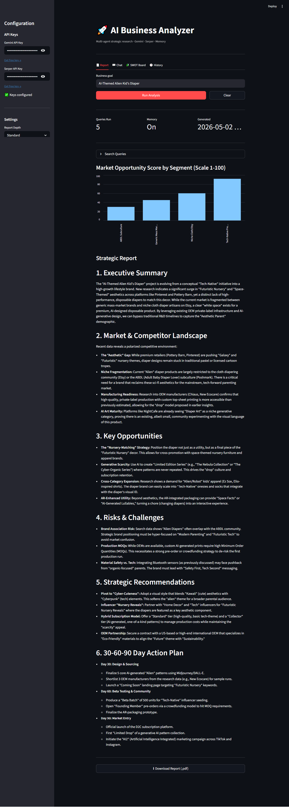

<div align="center">

# 🤖 AI Business Analyzer



<p>
  
  
  
  
  
  
</p>

<p>
  
</p>

An autonomous AI-powered business analysis system that researches markets, stores historical insights, and generates structured strategic reports — using persistent memory, live web data, and a clean Streamlit interface.

**[🔗 Live Demo](https://ai-business-analyzer.streamlit.app/)**

</div>

---

## 🚀 Features

- **Modular agent architecture** for clean separation of concerns
- **Goal-to-task planning** powered by Gemini LLM
- **Live web search** via Serper.dev API
- **Persistent memory** with SQLite for historical insight storage
- **Structured report generation** with actionable business intelligence
- **SWOT analysis tab** for dedicated strategic breakdown
- **Chat interface** for interactive follow-up queries
- **PDF export** for saving and sharing reports
- **Streamlit front-end** for an intuitive user experience
- **UV-based** dependency management for fast, reliable installs

---

## 🧠 Architecture Overview

```
User Goal
  → Planner Module
  → Web Search Tool (Serper.dev)
  → Result Aggregator
  → Context Memory
  → Report Generator
  → Memory Storage (SQLite)
  → Streamlit UI Output (Chat / History / SWOT tabs)
```

---

## 🗂 Project Structure

```
├── Visuals
│   └── AI-Business-Analyzer.png
├── agents
│   ├── __init__.py
│   ├── aggregator.py
│   ├── planner.py
│   ├── reporter.py
│   ├── researcher.py
│   └── summarizer.py
├── config
│   └── settings.py
├── core
│   ├── __init__.py
│   └── llm.py
├── database
│   ├── init_db.py
│   ├── read.py
│   └── write.py
├── tabs
│   ├── chat.py
│   ├── history.py
│   └── swot.py
├── utils
│   └── build_pdf.py
├── .gitignore
├── LICENSE
├── README.md
├── main.py
├── pyproject.toml
├── requirements.txt
└── uv.lock
```

---

## 🛠 Tech Stack

| Layer | Tool |
|---|---|
| LLM | Gemini API (`gemini-3-flash-preview`) |
| Web Search | Serper.dev |
| Memory | SQLite |
| Frontend | Streamlit |
| Package Management | UV |
| Language | Python 3.12+ |

---

## ⚙️ Getting Started

### Prerequisites

- Python 3.12+
- [UV](https://github.com/astral-sh/uv) installed
- A [Gemini API key](https://ai.google.dev/)
- A [Serper.dev API key](https://serper.dev/)

### Installation

**1. Clone the repository**

```bash
git clone https://github.com/PypCoder/AI-Business-Analyzer.git
cd AI-Business-Analyzer
```

**2. Install dependencies with UV**

```bash
uv venv
source .venv/bin/activate  # On Windows: .venv\Scripts\activate
uv pip install -r requirements.txt
```

**3. Set up environment variables**

Create a `.env` file in the root directory:

```env
GEMINI_API_KEY=your_gemini_api_key
SERPER_API_KEY=your_serper_api_key
```

**4. Run the app**

```bash
streamlit run main.py
```

---

## 📊 Example Use Case

**Input:**
> "Coffee subscription startup in New York"

**Output:**

- Executive Summary
- Market & Competitor Landscape
- Key Opportunities
- Risks & Challenges
- Strategic Recommendations
- 30-60-90 Day Action Plan
- Exportable PDF Report
- SWOT Analysis

---

## 🌐 Deployment

This app is deployed on **Streamlit Community Cloud**.

> 🔗 [Live Demo](https://ai-business-analyzer.streamlit.app/)

---

## 📌 Purpose

This project demonstrates applied AI agent engineering, tool integration, persistent memory handling, and end-to-end system design for business intelligence automation. It serves as a practical example of building production-ready agentic AI systems.

---

## 📄 License

This project is licensed under the [MIT License](LICENSE).

---

<div align="center">
  <a href="https://github.com/PypCoder" target="_blank">
    
  </a>
</div>